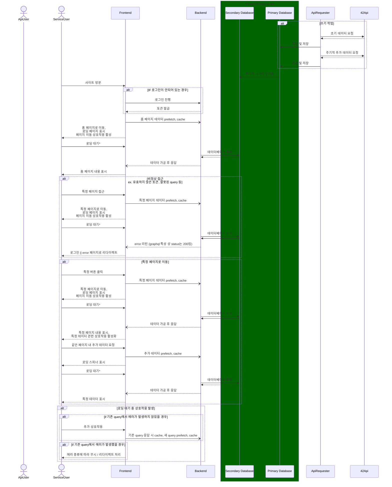

```mermaid
sequenceDiagram
  actor AU as ApiUser
  actor SU as ServiceUser
  participant FE as Frontend
  participant BE as Backend
  box DarkGreen MongoDB Replica set
  participant SD as Secondary Database
  participant PD as Primary Database
  end
  participant AR as ApiRequester
  participant 42Api
    alt 쓰기 작업
    AR->>42Api: 초기 데이터 요청
    42Api-->>AR: 
    AR->>PD: 가공 및 저장
    AR->>42Api: 주기적 추가 데이터 요청
    42Api-->>AR: 
    AR->>PD: 가공 및 저장
    end
    PD-)SD: 주기적 데이터 동기화
    SU->>FE: 사이트 방문
    alt IF 로그인이 안되어 있는 경우
      FE->>BE: 로그인 진행
      BE-->>FE: 토큰 발급
    end
    FE-)BE: 홈 페이지 데이터 prefetch, cache
    FE-->>SU: 홈 페이지로 이동,<br/>로딩 페이지 표시<br/>페이지 이동 상호작용 활성
    SU->>FE: 로딩 대기*
    BE->>SD: 데이터베이스 조회
    SD-->>BE: 
    BE--)FE: 데이터 가공 후 응답
    FE-->>SU: 홈 페이지 내용 표시
    alt 비정상 접근<br/>ex. 유효하지 않은 토큰, 잘못된 query 등
    SU->>FE: 특정 페이지 접근
    FE-)BE: 특정 페이지 데이터 prefetch, cache
    FE-->>SU: 특정 페이지로 이동,<br/>로딩 페이지 표시<br/>페이지 이동 상호작용 활성
    SU->>FE: 로딩 대기*
    BE->>SD: 데이터베이스 조회
    SD->>BE: 
    BE--)FE: error 리턴 (graphql 특성 상 status는 200임)
    FE-->>SU: 로그인 || error 페이지로 리다이렉트
    end
    alt 특정 페이지로 이동
    SU->>FE: 특정 버튼 클릭
    FE-)BE: 특정 페이지 데이터 prefetch, cache
    FE-->>SU: 특정 페이지로 이동,<br/>로딩 페이지 표시<br/>페이지 이동 상호작용 활성
    SU->>FE: 로딩 대기*
    BE->>SD: 데이터베이스 조회
    SD->>BE: 
    BE--)FE: 데이터 가공 후 응답
    FE-->>SU: 특정 페이지 내용 표시,<br/>특정 데이터 관련 상호작용 활성화
    SU->>FE: 같은 페이지 내 추가 데이터 요청
    FE-)BE: 추가 데이터 prefetch, cache
    FE-->>SU: 로딩 스피너 표시
    SU->>FE: 로딩 대기*
    BE->>SD: 데이터베이스 조회
    SD-->>BE: 
    BE--)FE: 데이터 가공 후 응답
    FE-->>SU: 특정 데이터 표시
    end
    alt 로딩 대기 중 상호작용 발생
    alt if 기존 query에서 에러가 발생하지 않았을 경우
    SU->>FE: 추가 상호작용
    FE-)BE: 기존 query 응답 시 cache, 새 query prefetch, cache
    end
    alt if 기존 query에서 에러가 발생했을 경우
    FE-->>SU: 에러 종류에 따라 무시 / 리다이렉트 처리
    end
    end
```
