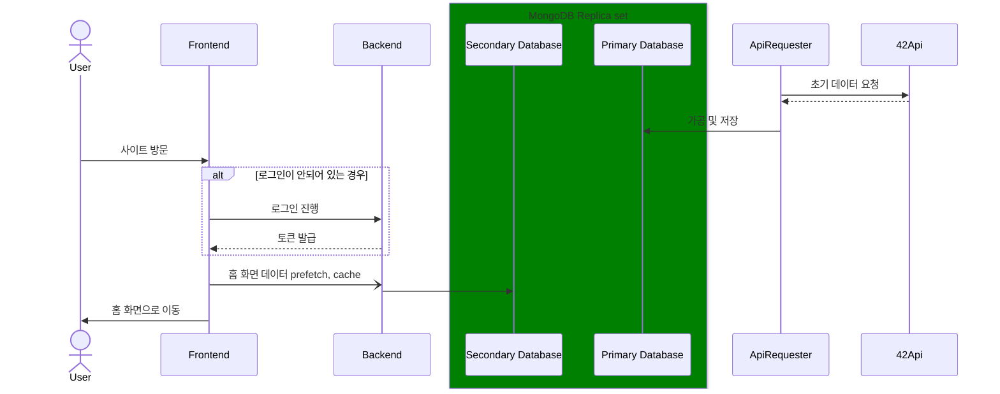

```mermaid
sequenceDiagram
  actor User
  participant Frontend
  participant Backend
  box Green MongoDB Replica set
  participant SD as Secondary Database
  participant PD as Primary Database
  end
  participant ApiRequester
  participant 42Api
    ApiRequester->>42Api: 초기 데이터 요청
    42Api-->>ApiRequester: 
    ApiRequester->>PD: 가공 및 저장
    User->>Frontend: 사이트 방문
    alt 로그인이 안되어 있는 경우
      Frontend->>Backend: 로그인 진행
      Backend-->>Frontend: 토큰 발급
    end
    Frontend-)Backend: 홈 화면 데이터 prefetch, cache
    Backend->>SD: 
    Frontend->>User: 홈 화면으로 이동
```
